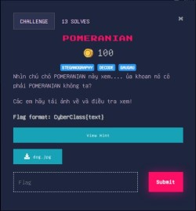
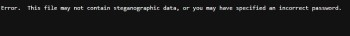
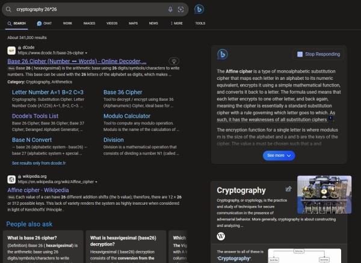
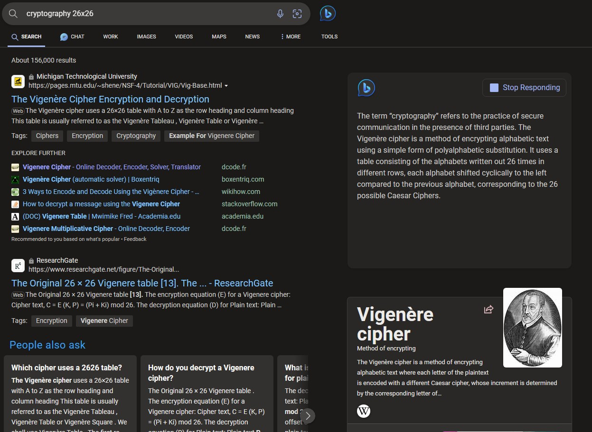
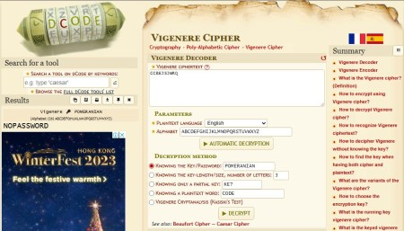
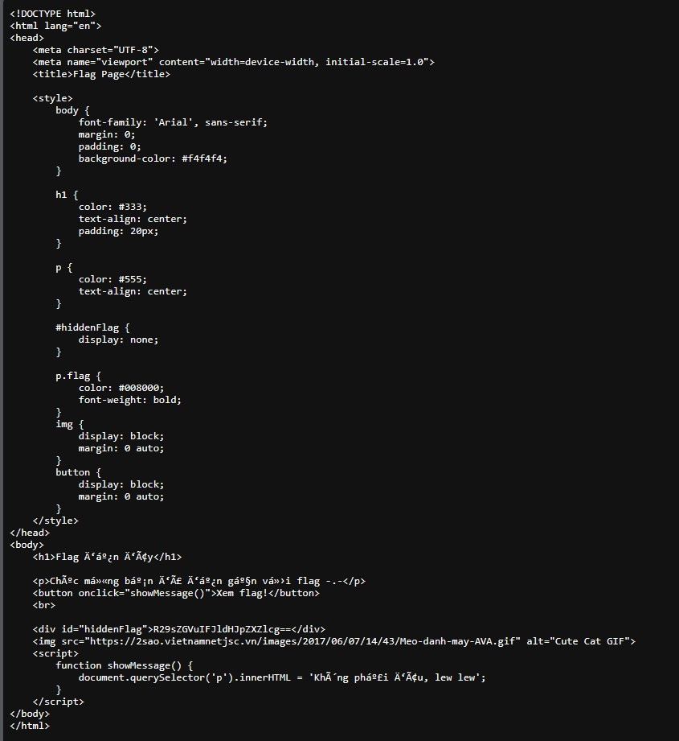

# Đây là writeup của CyberClass ctf lần 2

Lần này gồm có 3 challenges về 3 mảng khác nhau:
> -Steganography
> -Cryptography
> -Forensic

## Steganography challenge: POMERIAN
Đề bài:

Đề bài cho chúng ta 1 bức ảnh về chó pomerian và 1 hint
 
Theo như hint này thì chúng ta phải dùng tool Steganography để tìm dữ liệu trong ảnh, ta cũng được cho mật khẩu là: `CCBEJSJWRQ` và 1 cái hint về `cryptography 26*26`.
Mình đã thử và có vẻ mật khẩu này là không đúng.

Khả năng cao là nó đã bị mã hóa nên mình đã tìm về cryptography 26*26 nhưng không nhận được gì!

Sau đấy thì mình nhận ra, 26*26 hay 26x26 có thể là kích thước của bảng nên mình đã search `cryptography 26x26` và nhận được cách mã hóa đúng.

Thông qua đề bài, để ý chữ `POMERIAN` được viết in hoa, mình biết nó sẽ là pass để giải mã và mình đã giải mã thành công
Mật khẩu đúng: `NOPASSWORD`

Dễ dàng nhận ra đây là base64, giải mã và ghép với dữ kiện đề, ta nhận được flag.
Flag: `CyberClass{Golden Retriever}`